# Plantillas de Diagramas — Soluciones con Mermaid

> **Cómo usar este archivo:**
> 1. Identifica el patrón de tu algoritmo en la tabla de contenidos
> 2. Copia el bloque `:::plantilla` correspondiente
> 3. Reemplaza los textos en `MAYÚSCULAS` con los valores de tu algoritmo
> 4. El ejemplo concreto debajo de cada plantilla te muestra cómo quedó llenado

---

## Tabla de contenidos

| # | Patrón | Forma visual |
|---|---|---|
| 1 | [Recursión Lineal](#1--recursión-lineal) | Cadena vertical |
| 2 | [Recursión con Múltiples Llamadas](#2--recursión-con-múltiples-llamadas) | Árbol n-ario |
| 3 | [Divide y Vencerás](#3--divide-y-vencerás) | Árbol con fase de merge |
| 4 | [DP con Memoización](#4--dp-con-memoización-top-down) | Árbol con nodos cacheados |
| 5 | [BFS por Niveles](#5--bfs-por-niveles) | Grafo por capas horizontales |
| 6 | [DFS y Backtracking](#6--dfs-y-backtracking) | Árbol con ramas podadas |
| 7 | [Algoritmo Greedy / Iterativo](#7--algoritmo-greedy--iterativo) | Flujo lineal con decisión |

---

## Convenciones de color

```
Verde  (#90EE90) → Caso base / condición de parada
Azul   (#87CEEB) → Llamada recursiva / nodo en proceso
Naranja(#FFD580) → Resultado cacheado (memo hit)
Rojo   (#FFB3B3) → Rama podada (backtracking)
Gris   (#D3D3D3) → Nodo auxiliar / combinación / merge
```

---

## 1 · Recursión Lineal

> **Cuándo usarla:** la función se llama a sí misma exactamente una vez por nivel.
> Complejidad típica: `O(n)` tiempo, `O(n)` espacio en el call stack.

### Plantilla vacía

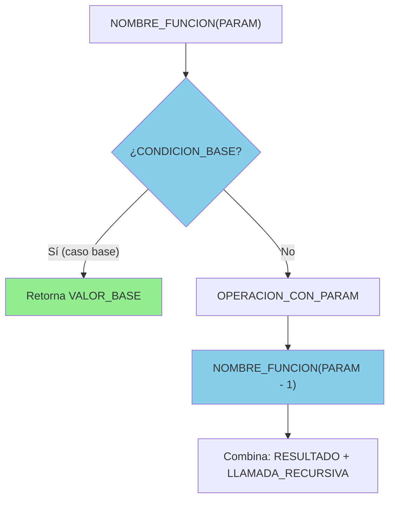

### Ejemplo concreto: `factorial(n)`

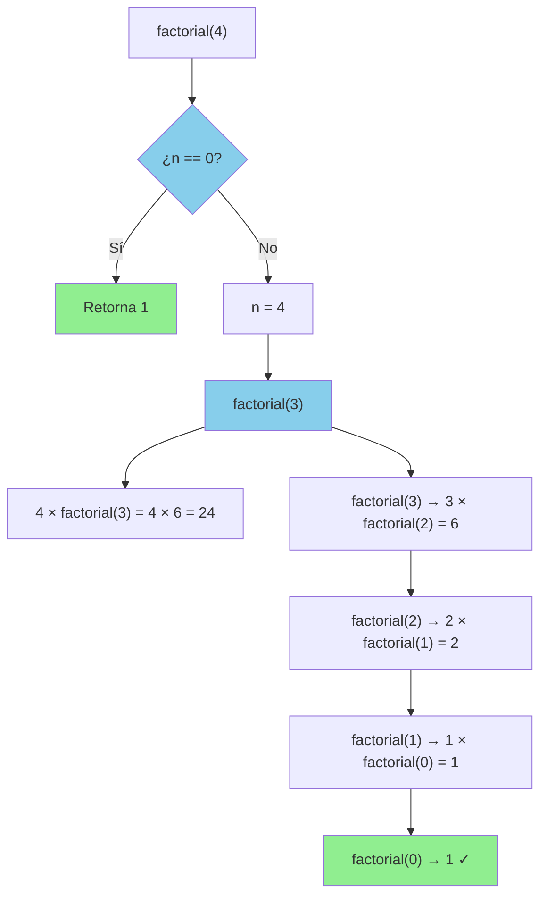

---

## 2 · Recursión con Múltiples Llamadas

> **Cuándo usarla:** la función genera 2 o más llamadas recursivas por nivel.
> Complejidad típica: `O(2^n)` sin memo, árbol de altura `n`.

### Plantilla vacía

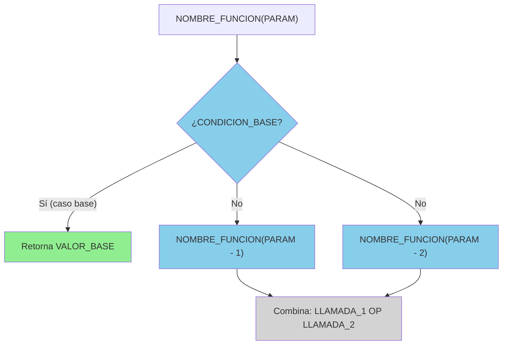

### Ejemplo concreto: `fibonacci(5)`

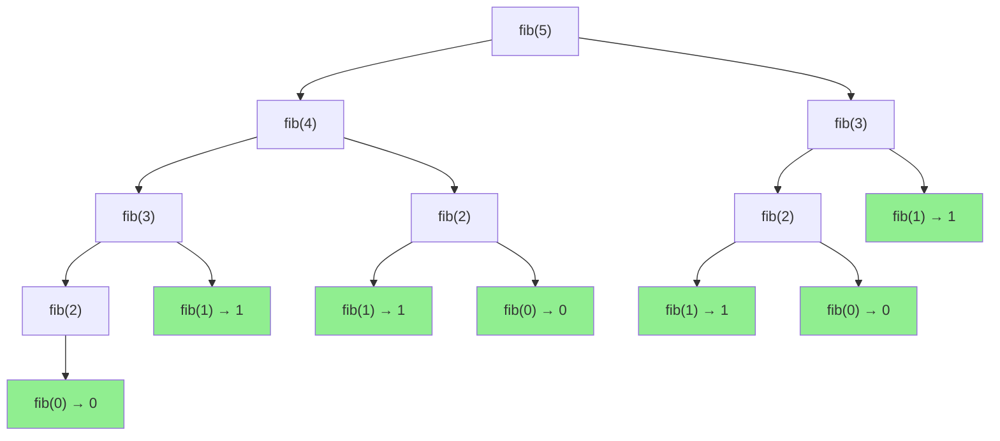

> 💡 Observa los nodos repetidos: `fib(3)` aparece 2 veces, `fib(2)` aparece 3 veces.
> Esto motiva la memoización (Plantilla 4).

---

## 3 · Divide y Vencerás

> **Cuándo usarla:** el problema se parte en subproblemas independientes,
> se resuelven por separado y se combinan. Complejidad típica: `O(n log n)`.

### Plantilla vacía

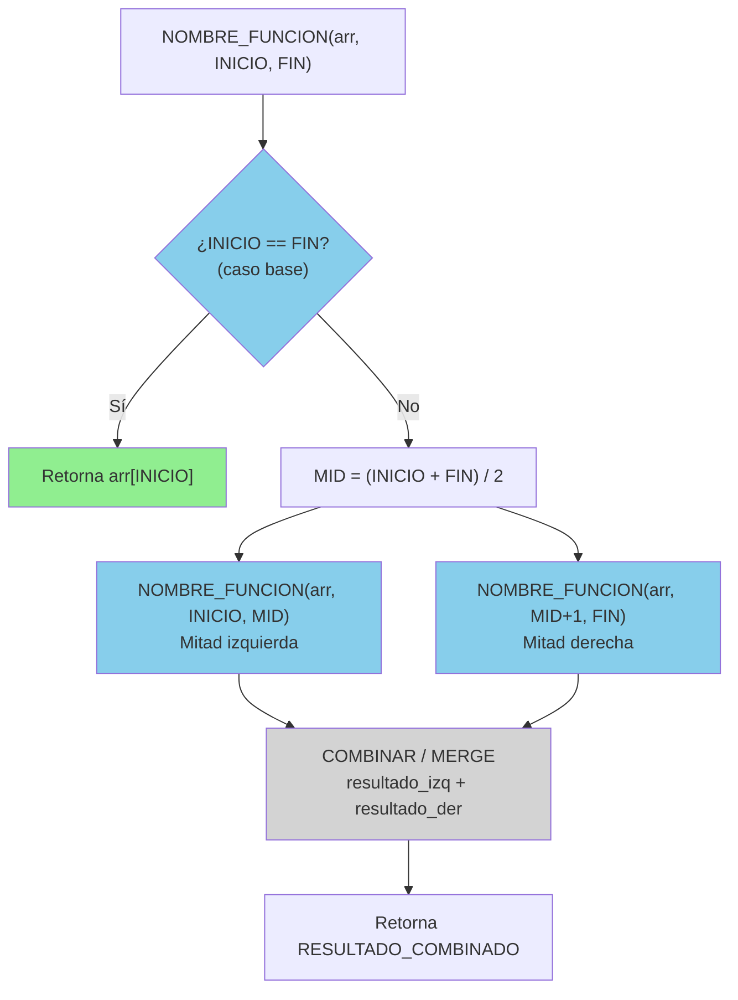

### Ejemplo concreto: `merge_sort([3, 1, 4, 1, 5])`

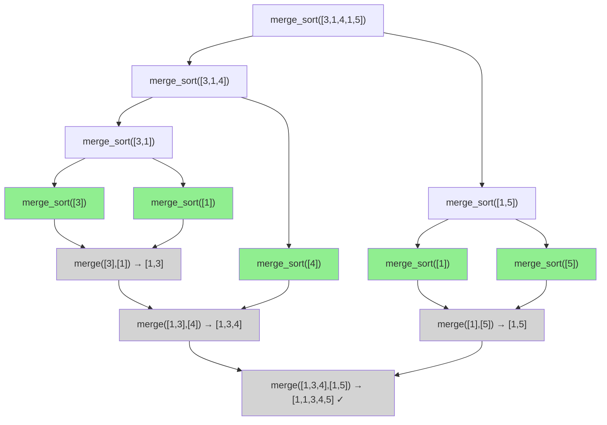

---

## 4 · DP con Memoización (Top-Down)

> **Cuándo usarla:** igual que Plantilla 2 (múltiples llamadas) pero con
> subproblemas **solapados**. Los nodos cacheados se marcan en naranja.

### Plantilla vacía

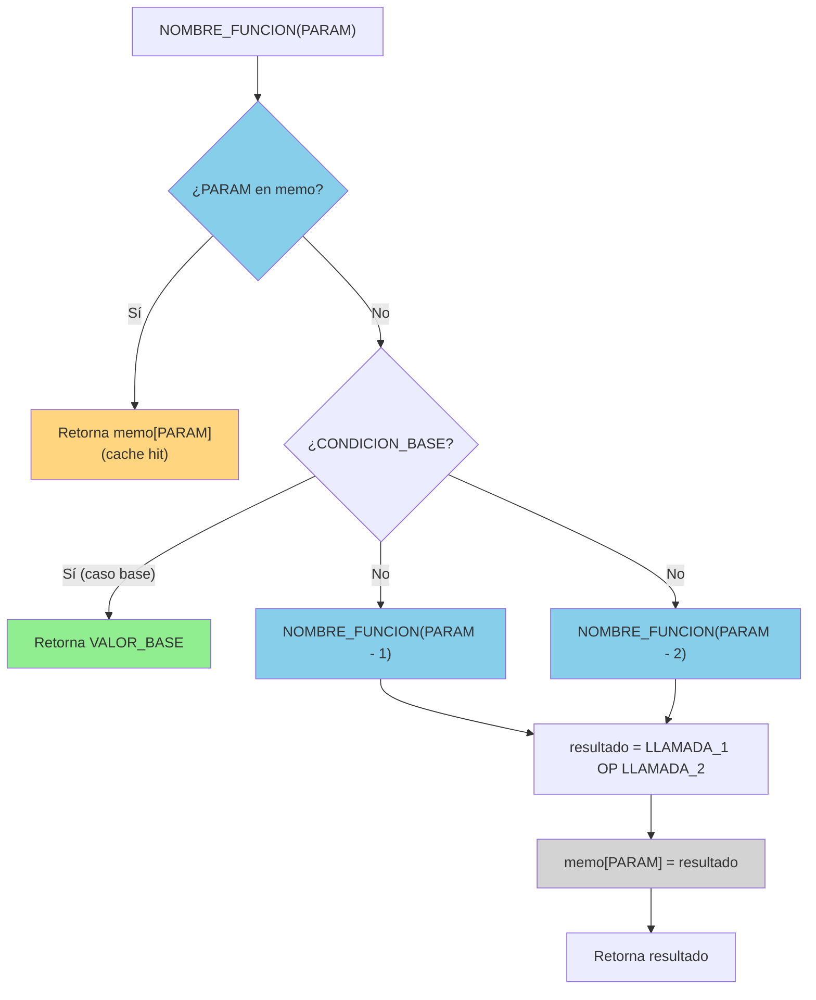

### Ejemplo concreto: `fib_memo(5)` — comparar con Plantilla 2

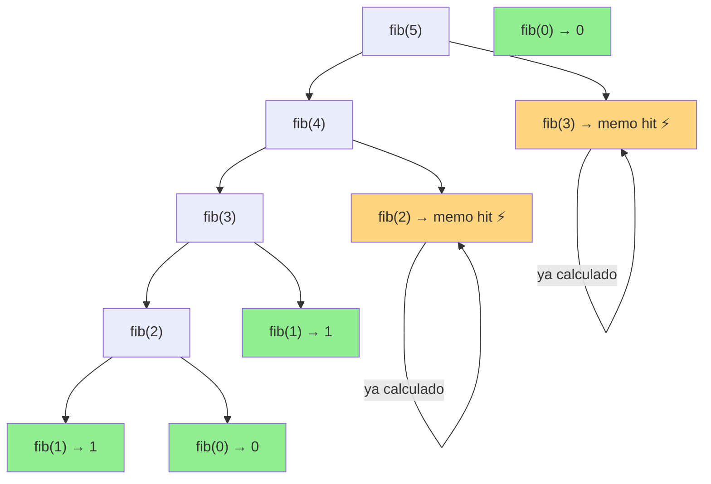

> 💡 De 13 nodos (Plantilla 2) a 7 nodos. Cada subproblema se calcula **una sola vez**.

---

## 5 · BFS por Niveles

> **Cuándo usarla:** exploración de grafos nivel por nivel, camino más corto
> en grafos no ponderados. Complejidad: `O(V + E)`.

### Plantilla vacía

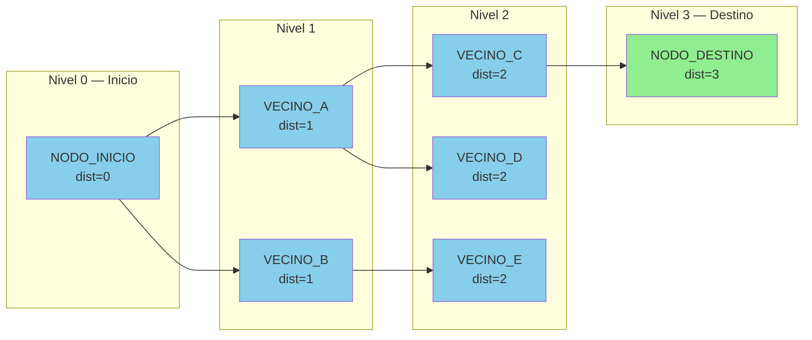

### Ejemplo concreto: BFS desde `A` hasta `F`

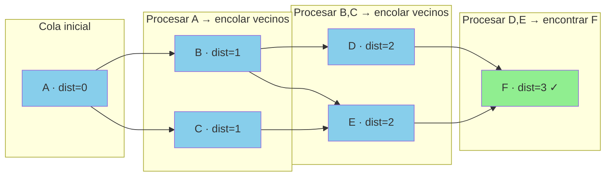

---

## 6 · DFS y Backtracking

> **Cuándo usarla:** exploración exhaustiva con poda. Las ramas que violan
> restricciones se cortan antes de explorar. Complejidad: `O(b^d)` en peor caso.

### Plantilla vacía

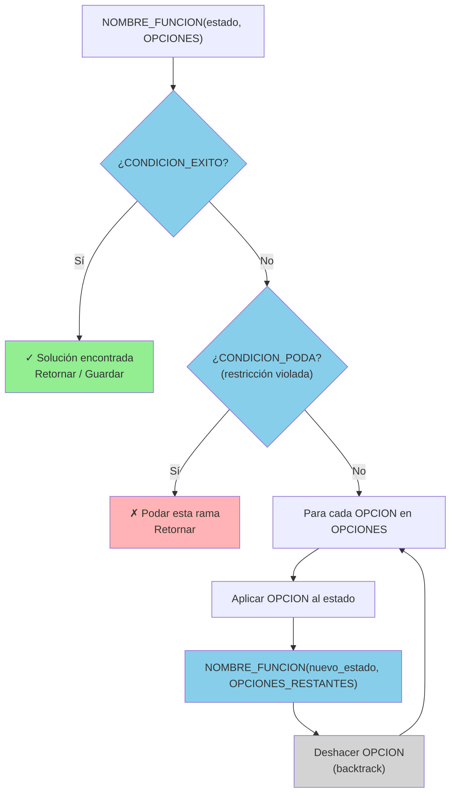

### Ejemplo concreto: N-Reinas con `n=4`, columna 1

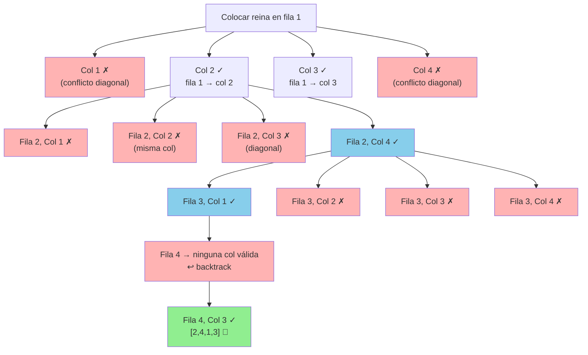

---

## 7 · Algoritmo Greedy / Iterativo

> **Cuándo usarla:** el algoritmo avanza paso a paso tomando la decisión localmente
> óptima sin retroceder. También sirve para algoritmos iterativos con condición de avance.

### Plantilla vacía

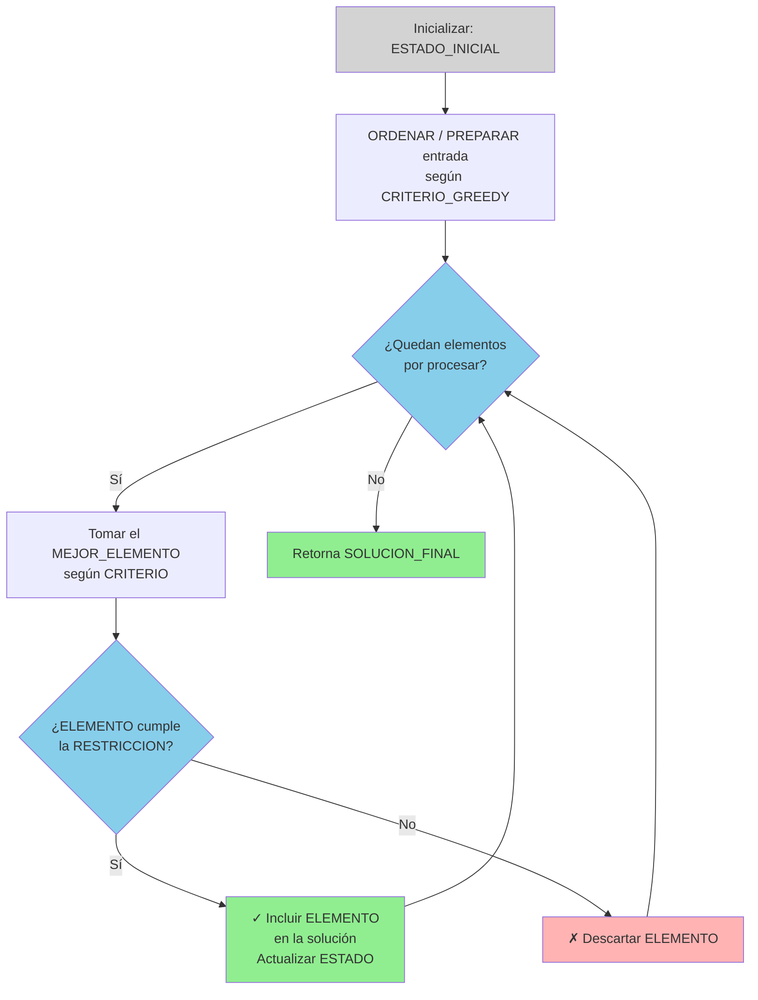

### Ejemplo concreto: Intervalos no solapados

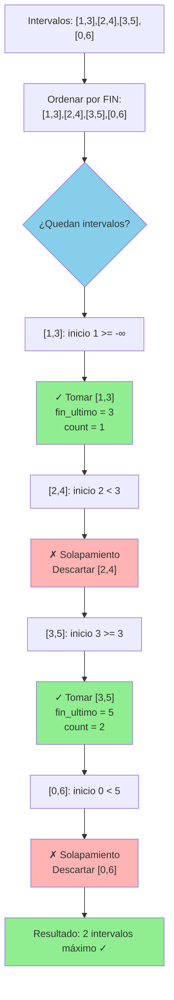

---

## Guía rápida de sintaxis Mermaid

```markdown
<!-- Tipos de diagrama más útiles para algoritmos -->

flowchart TD   ← top-down (árbol de recursión)
flowchart LR   ← left-right (BFS por niveles, flujos)

<!-- Formas de nodos -->
A["texto"]         ← rectángulo (nodo normal)
B{"texto"}         ← rombo (decisión / condición)
C(["texto"])       ← estadio (inicio/fin)
D[/"texto"/]       ← paralelogramo (entrada/salida)

<!-- Tipos de flecha -->
A --> B            ← flecha normal
A -- "etiqueta" --> B   ← flecha con etiqueta
A -.-> B           ← flecha punteada

<!-- Colores (style) -->
style A fill:#90EE90    ← verde (caso base)
style A fill:#87CEEB    ← azul (recursión activa)
style A fill:#FFD580    ← naranja (cache hit)
style A fill:#FFB3B3    ← rojo (poda)
style A fill:#D3D3D3    ← gris (combinación)

<!-- Subgrafos (para BFS por niveles) -->
subgraph Nombre["Etiqueta visible"]
    A["nodo"]
end
```

---

## Cómo crear tu propia solución

1. **Identifica el patrón** usando la tabla del inicio
2. **Copia la plantilla vacía** del patrón correspondiente
3. **Rellena en este orden:**
   - Reemplaza `NOMBRE_FUNCION` con el nombre de tu función
   - Reemplaza `CONDICION_BASE` y `VALOR_BASE`
   - Reemplaza `PARAM` con el parámetro clave (n, arr, i, etc.)
   - Reemplaza `OPERACION` con la lógica de tu algoritmo
4. **Agrega el ejemplo concreto** con valores pequeños (n=3 o n=4)
5. **Verifica** que Mermaid lo renderiza sin errores

> **Tip:** Si tu algoritmo combina patrones (ej: DFS + memo = DP en grafos),
> puedes anidar o combinar dos plantillas en el mismo diagrama usando `subgraph`.
