# Plantillas de Diagramas — Soluciones con Mermaid

> **Cómo usar este archivo:**
> 1. Identifica el patrón de tu algoritmo en la tabla de contenidos
> 2. Copia el bloque de la plantilla correspondiente
> 3. Reemplaza los textos en `MAYÚSCULAS` con los valores de tu algoritmo
> 4. El ejemplo concreto debajo de cada plantilla muestra cómo queda llenado

---

## Convenciones de color (consistentes en todas las plantillas)

| Color | Hex | Significado |
|---|---|---|
| 🟢 Verde | `#90EE90` | Caso base · Solución encontrada · Resultado final |
| 🔵 Azul | `#87CEEB` | Llamada activa · Nodo en proceso · Decisión |
| 🟠 Naranja | `#FFD580` | Cache hit · Memo · Valor ya calculado |
| 🔴 Rojo | `#FFB3B3` | Rama podada · Descartado · Inválido |
| ⬜ Gris | `#D3D3D3` | Combinación · Merge · Auxiliar |
| 🟣 Violeta | `#DDA0DD` | Estado visitado (grafos) |
| 🟡 Amarillo | `#FFFACD` | Nodo en cola / pendiente |

---

## Tabla de contenidos

| # | Patrón | Capítulo | Forma visual |
|---|---|---|---|
| 1 | [Recursión Lineal](#1--recursión-lineal) | Cap.01 §1 | Cadena vertical |
| 2 | [Múltiples Casos Base](#2--múltiples-casos-base) | Cap.01 §2 | Diamante inicial |
| 3 | [Múltiples Llamadas Recursivas](#3--múltiples-llamadas-recursivas) | Cap.01 §3 | Árbol binario |
| 4 | [Recursión por Paridad O(log n)](#4--recursión-por-paridad-olog-n) | Cap.01 §4 | Cadena logarítmica |
| 5 | [Recursión de Cola con Acumulador](#5--recursión-de-cola-con-acumulador) | Cap.01 §5 | Cadena plana |
| 6 | [DP Memoización Top-Down](#6--dp-memoización-top-down) | Cap.01 §6 | Árbol con nodos cacheados |
| 7 | [Divide y Vencerás](#7--divide-y-vencerás) | Cap.01 §7 | Árbol con fase merge |
| 8 | [DFS en Árbol o Grafo](#8--dfs-en-árbol-o-grafo) | Cap.01 §8 | Pre/In/Post-order |
| 9 | [DP Tabulación Bottom-Up](#9--dp-tabulación-bottom-up) | Cap.02 §2 | Tabla llenada de izq a der |
| 10 | [Backtracking con Poda](#10--backtracking-con-poda) | Cap.02 §3 | Árbol con ramas cortadas |
| 11 | [Stack Explícito sin recursión](#11--stack-explícito-sin-recursión) | Cap.02 §4 | Flujo con pila |
| 12 | [Dos Punteros](#12--dos-punteros) | Cap.03 §2 | Arreglo con punteros |
| 13 | [Ventana Deslizante](#13--ventana-deslizante) | Cap.03 §3 | Arreglo con ventana |
| 14 | [Prefix Sums](#14--prefix-sums) | Cap.03 §4 | Tabla acumulada |
| 15 | [Pila Monótona](#15--pila-monótona) | Cap.03 §7 | Arreglo con pila |
| 16 | [BFS por Niveles](#16--bfs-por-niveles) | Cap.04 §1 | Capas horizontales |
| 17 | [DFS con Timestamps](#17--dfs-con-timestamps) | Cap.04 §2 | DFS numerado |
| 18 | [Dijkstra](#18--dijkstra) | Cap.04 §3 | Grafo con distancias |
| 19 | [Bellman-Ford](#19--bellman-ford) | Cap.04 §4 | Relajación iterativa |
| 20 | [Floyd-Warshall](#20--floyd-warshall) | Cap.04 §5 | Matriz todos-contra-todos |
| 21 | [Kruskal y Prim MST](#21--kruskal-y-prim-mst) | Cap.04 §6 | Grafo con MST |
| 22 | [Ordenamiento Topológico Kahn](#22--ordenamiento-topológico-kahn) | Cap.04 §7 | DAG con grados |
| 23 | [Heap sift-up y sift-down](#23--heap-sift-up-y-sift-down) | Cap.05 | Árbol heap |
| 24 | [Greedy Genérico](#24--greedy-genérico) | Cap.06 | Flujo con decisión |
| 25 | [Union-Find con Compresión](#25--union-find-con-compresión) | Cap.09 | Árbol de componentes |
| 26 | [Trie Insertar y Buscar](#26--trie-insertar-y-buscar) | Cap.10 | Árbol de prefijos |
| 27 | [KMP Tabla de Fallos y Búsqueda](#27--kmp-tabla-de-fallos-y-búsqueda) | Cap.12 | Flujo de comparación |
| 28 | [Bitmask DP](#28--bitmask-dp) | Cap.13 §4 | Estados como máscaras |

---

## 1 · Recursión Lineal

> Una sola llamada recursiva por nivel. Avanza hacia el caso base de a un paso.
> **Complejidad:** `O(n)` tiempo · `O(n)` stack

### Plantilla

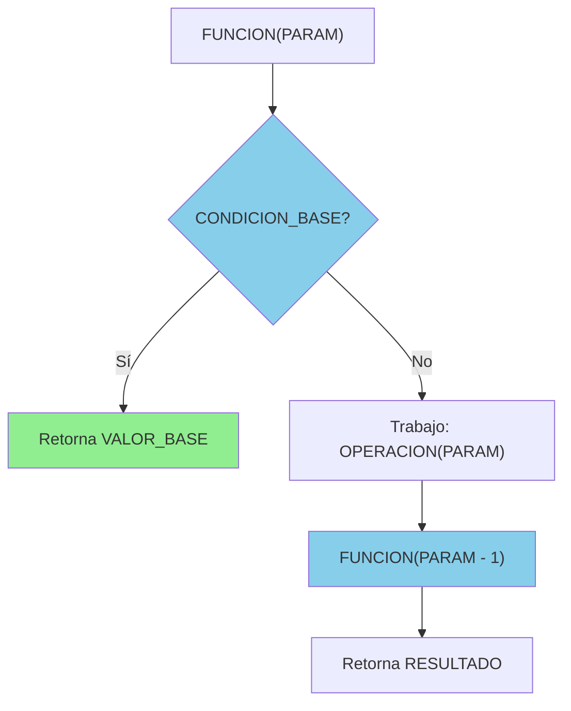
```mermaid
flowchart TD
    A["FUNCION(PARAM)"]
    B{"CONDICION_BASE?"}
    C["Retorna VALOR_BASE"]
    D["Trabajo: OPERACION(PARAM)"]
    E["FUNCION(PARAM - 1)"]
    F["Retorna RESULTADO"]

    A --> B
    B -- "Sí" --> C
    B -- "No" --> D --> E --> F

    style C fill:#90EE90
    style B fill:#87CEEB
    style E fill:#87CEEB
```

### Ejemplo: factorial(4)

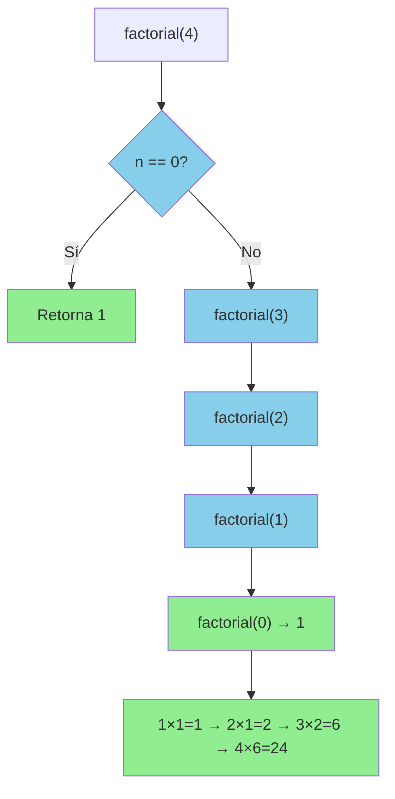
```mermaid
flowchart TD
    A["factorial(4)"]
    B{"n == 0?"}
    C["Retorna 1"]
    D["factorial(3)"]
    E["factorial(2)"]
    F["factorial(1)"]
    G["factorial(0) → 1"]
    H["1×1=1 → 2×1=2 → 3×2=6 → 4×6=24"]

    A --> B
    B -- "No" --> D --> E --> F --> G --> H
    B -- "Sí" --> C

    style C fill:#90EE90
    style G fill:#90EE90
    style H fill:#90EE90
    style B fill:#87CEEB
    style D fill:#87CEEB
    style E fill:#87CEEB
    style F fill:#87CEEB
```

---

## 2 · Múltiples Casos Base

> Más de una condición de parada. Común en Fibonacci, búsqueda binaria, palíndromos.
> **Complejidad:** `O(n)` o `O(2^n)` según la lógica

### Plantilla

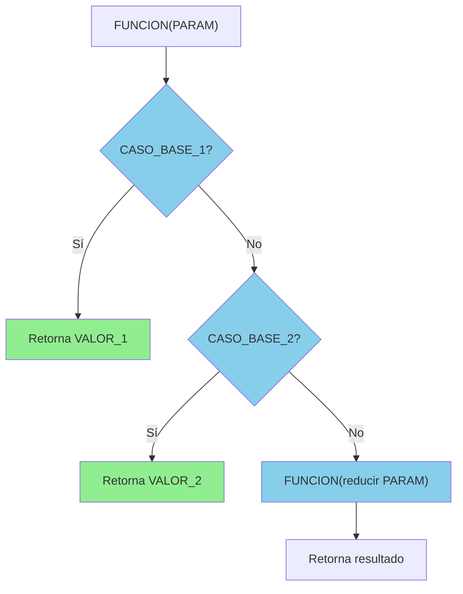
```mermaid
flowchart TD
    A["FUNCION(PARAM)"]
    B{"CASO_BASE_1?"}
    C["Retorna VALOR_1"]
    D{"CASO_BASE_2?"}
    E["Retorna VALOR_2"]
    F["FUNCION(reducir PARAM)"]
    G["Retorna resultado"]

    A --> B
    B -- "Sí" --> C
    B -- "No" --> D
    D -- "Sí" --> E
    D -- "No" --> F --> G

    style C fill:#90EE90
    style E fill:#90EE90
    style B fill:#87CEEB
    style D fill:#87CEEB
    style F fill:#87CEEB
```

### Ejemplo: fibonacci con n=0 y n=1

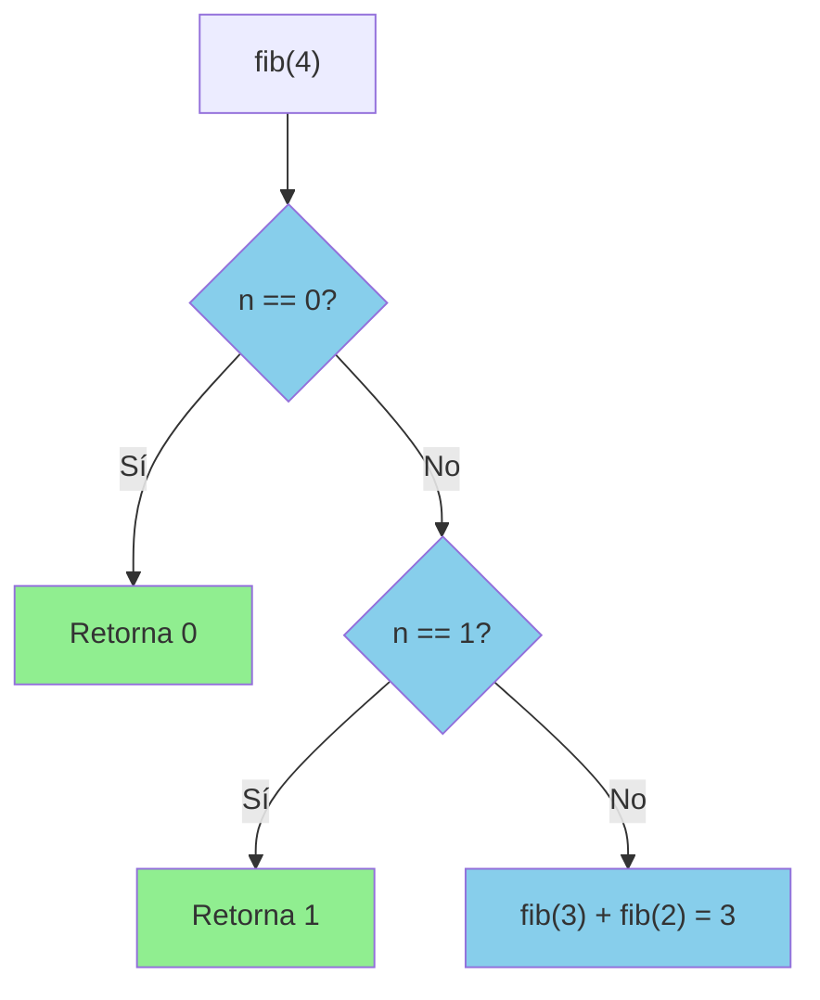
```mermaid
flowchart TD
    A["fib(4)"]
    B{"n == 0?"}
    C["Retorna 0"]
    D{"n == 1?"}
    E["Retorna 1"]
    F["fib(3) + fib(2) = 3"]

    A --> B
    B -- "Sí" --> C
    B -- "No" --> D
    D -- "Sí" --> E
    D -- "No" --> F

    style C fill:#90EE90
    style E fill:#90EE90
    style B fill:#87CEEB
    style D fill:#87CEEB
    style F fill:#87CEEB
```

---

## 3 · Múltiples Llamadas Recursivas

> Cada invocación genera 2+ llamadas. Produce un árbol de llamadas exponencial.
> **Complejidad:** `O(2^n)` sin memo — motiva la Plantilla 6

### Plantilla

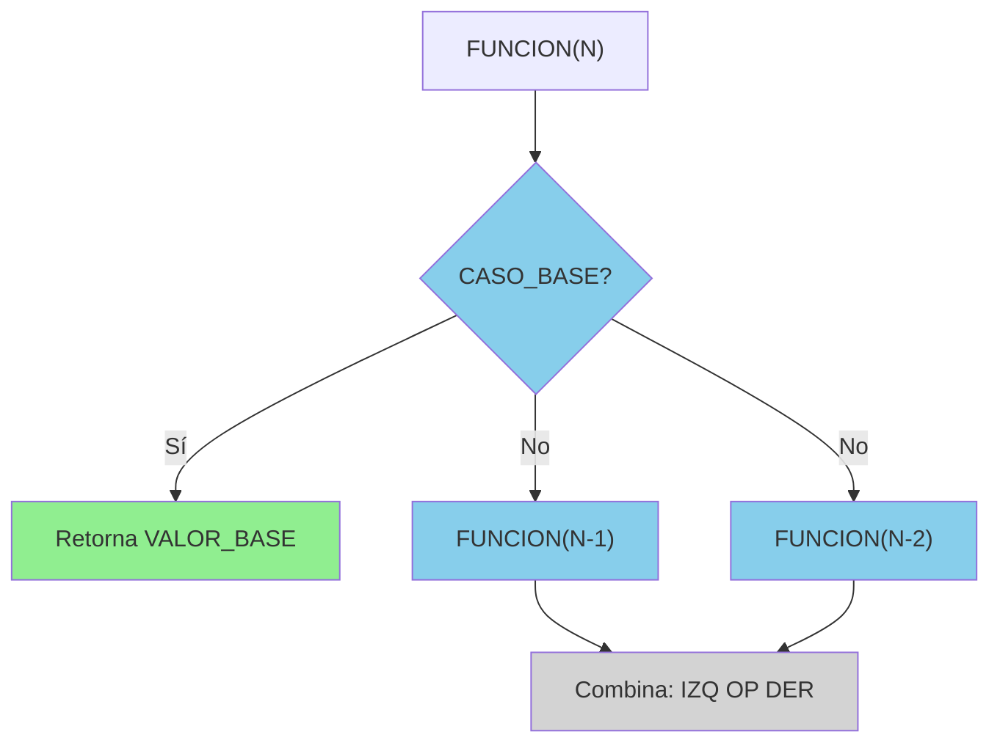
```mermaid
flowchart TD
    A["FUNCION(N)"]
    B{"CASO_BASE?"}
    C["Retorna VALOR_BASE"]
    D["FUNCION(N-1)"]
    E["FUNCION(N-2)"]
    F["Combina: IZQ OP DER"]

    A --> B
    B -- "Sí" --> C
    B -- "No" --> D
    B -- "No" --> E
    D --> F
    E --> F

    style C fill:#90EE90
    style B fill:#87CEEB
    style D fill:#87CEEB
    style E fill:#87CEEB
    style F fill:#D3D3D3
```

### Ejemplo: árbol de llamadas fib(4) — nodos en rojo = trabajo repetido

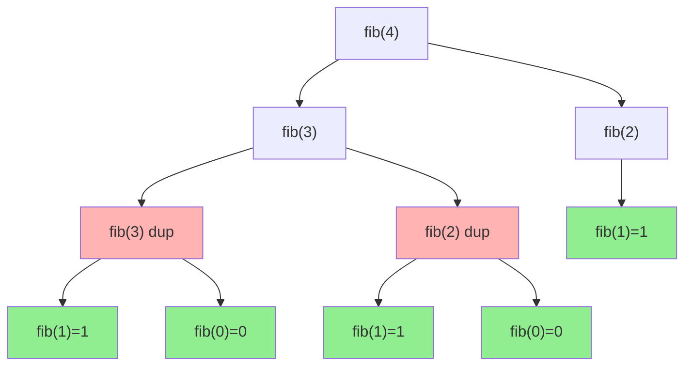
```mermaid
flowchart TD
    F4["fib(4)"]
    F3a["fib(3)"]
    F2a["fib(2)"]
    F3b["fib(3) dup"]
    F2b["fib(2) dup"]
    F1a["fib(1)=1"]
    F1b["fib(1)=1"]
    F1c["fib(1)=1"]
    F0a["fib(0)=0"]
    F0b["fib(0)=0"]

    F4 --> F3a
    F4 --> F2a
    F3a --> F3b
    F3a --> F2b
    F3b --> F1a
    F3b --> F0a
    F2b --> F1b
    F2b --> F0b
    F2a --> F1c

    style F1a fill:#90EE90
    style F1b fill:#90EE90
    style F1c fill:#90EE90
    style F0a fill:#90EE90
    style F0b fill:#90EE90
    style F3b fill:#FFB3B3
    style F2b fill:#FFB3B3
```

---

## 4 · Recursión por Paridad O(log n)

> El parámetro se divide entre 2 según sea par o impar.
> **Complejidad:** `O(log n)` — altura del árbol logarítmica

### Plantilla

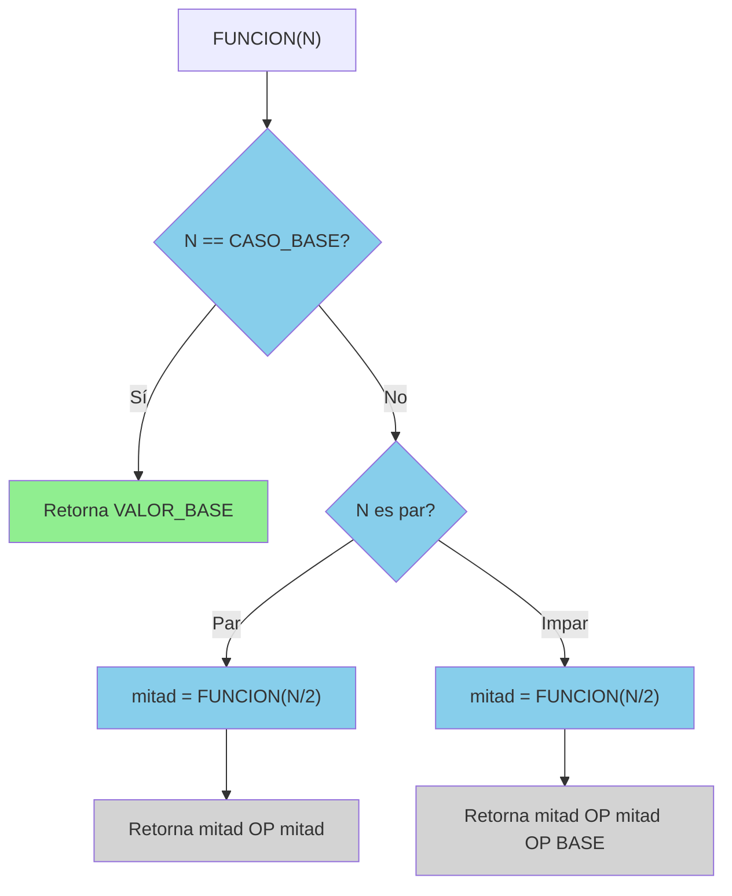
```mermaid
flowchart TD
    A["FUNCION(N)"]
    B{"N == CASO_BASE?"}
    C["Retorna VALOR_BASE"]
    D{"N es par?"}
    E["mitad = FUNCION(N/2)"]
    F["Retorna mitad OP mitad"]
    G["mitad = FUNCION(N/2)"]
    H["Retorna mitad OP mitad OP BASE"]

    A --> B
    B -- "Sí" --> C
    B -- "No" --> D
    D -- "Par" --> E --> F
    D -- "Impar" --> G --> H

    style C fill:#90EE90
    style B fill:#87CEEB
    style D fill:#87CEEB
    style E fill:#87CEEB
    style G fill:#87CEEB
    style F fill:#D3D3D3
    style H fill:#D3D3D3
```

### Ejemplo: pow(2, 10) — potencia rápida

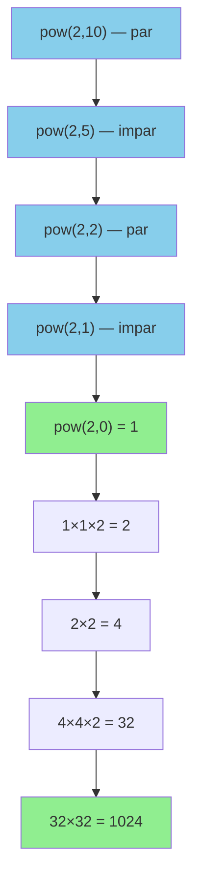
```mermaid
flowchart TD
    A["pow(2,10) — par"]
    B["pow(2,5) — impar"]
    C["pow(2,2) — par"]
    D["pow(2,1) — impar"]
    E["pow(2,0) = 1"]

    R1["1×1×2 = 2"]
    R2["2×2 = 4"]
    R3["4×4×2 = 32"]
    R4["32×32 = 1024"]

    A --> B --> C --> D --> E --> R1 --> R2 --> R3 --> R4

    style E fill:#90EE90
    style R4 fill:#90EE90
    style A fill:#87CEEB
    style B fill:#87CEEB
    style C fill:#87CEEB
    style D fill:#87CEEB
```

---

## 5 · Recursión de Cola con Acumulador

> El resultado parcial viaja como parámetro `acc`. No hay trabajo al subir.
> Con TCO usa `O(1)` espacio de stack.

### Plantilla

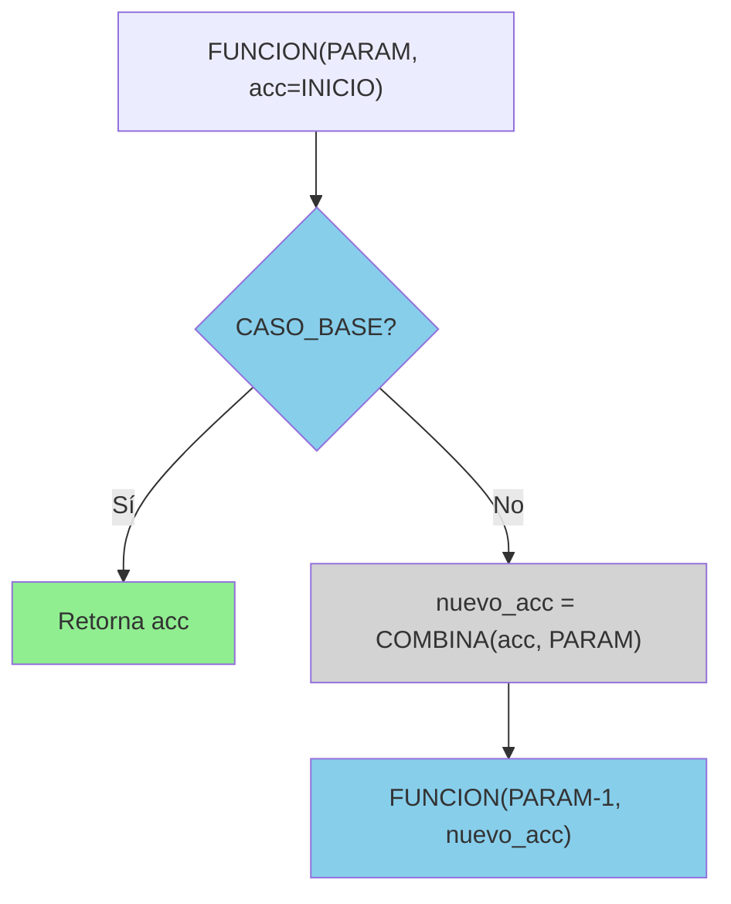
```mermaid
flowchart TD
    A["FUNCION(PARAM, acc=INICIO)"]
    B{"CASO_BASE?"}
    C["Retorna acc"]
    D["nuevo_acc = COMBINA(acc, PARAM)"]
    E["FUNCION(PARAM-1, nuevo_acc)"]

    A --> B
    B -- "Sí" --> C
    B -- "No" --> D --> E

    style C fill:#90EE90
    style B fill:#87CEEB
    style E fill:#87CEEB
    style D fill:#D3D3D3
```

### Ejemplo: factorial_tail(4, acc=1)


```mermaid
flowchart LR
    A["fact(4, acc=1)"]
    B["fact(3, acc=4)"]
    C["fact(2, acc=12)"]
    D["fact(1, acc=24)"]
    E["fact(0, acc=24)"]
    F["n=0 → Retorna 24 ✓"]

    A -- "acc=1×4=4" --> B
    B -- "acc=4×3=12" --> C
    C -- "acc=12×2=24" --> D
    D -- "acc=24×1=24" --> E
    E --> F

    style F fill:#90EE90
    style A fill:#87CEEB
    style B fill:#87CEEB
    style C fill:#87CEEB
    style D fill:#87CEEB
    style E fill:#87CEEB
```

---

## 6 · DP Memoización Top-Down

> Recursión + caché. Los subproblemas ya calculados se retornan en O(1).
> **Complejidad:** `O(n)` tiempo y espacio con `n` subproblemas únicos

### Plantilla

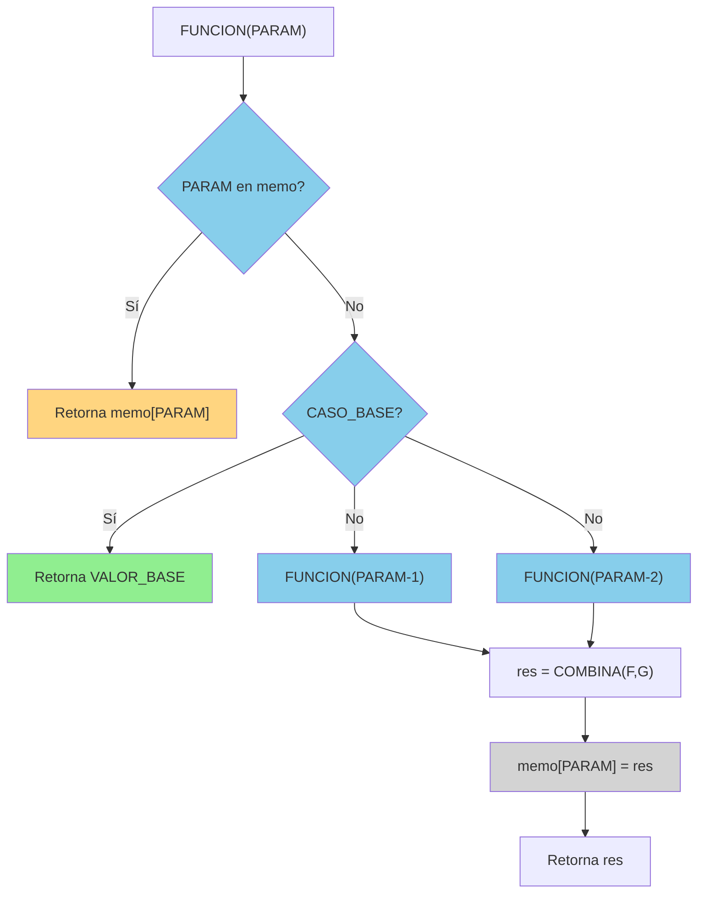
```mermaid
flowchart TD
    A["FUNCION(PARAM)"]
    B{"PARAM en memo?"}
    C["Retorna memo[PARAM]"]
    D{"CASO_BASE?"}
    E["Retorna VALOR_BASE"]
    F["FUNCION(PARAM-1)"]
    G["FUNCION(PARAM-2)"]
    H["res = COMBINA(F,G)"]
    I["memo[PARAM] = res"]
    J["Retorna res"]

    A --> B
    B -- "Sí" --> C
    B -- "No" --> D
    D -- "Sí" --> E
    D -- "No" --> F
    D -- "No" --> G
    F --> H
    G --> H
    H --> I --> J

    style C fill:#FFD580
    style E fill:#90EE90
    style B fill:#87CEEB
    style D fill:#87CEEB
    style F fill:#87CEEB
    style G fill:#87CEEB
    style I fill:#D3D3D3
```

### Ejemplo: fib_memo(5) — solo 7 nodos vs 13 sin memo

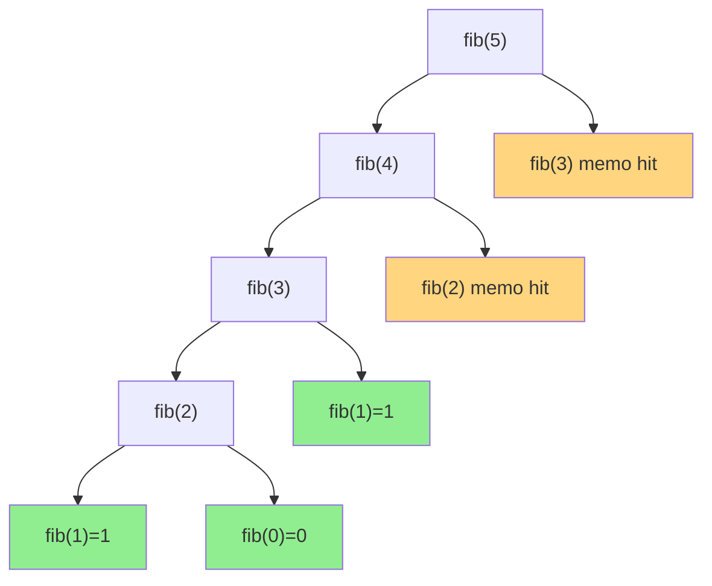
```mermaid
flowchart TD
    F5["fib(5)"]
    F4["fib(4)"]
    F3["fib(3)"]
    F3h["fib(3) memo hit"]
    F2["fib(2)"]
    F2h["fib(2) memo hit"]
    F1a["fib(1)=1"]
    F1b["fib(1)=1"]
    F0["fib(0)=0"]

    F5 --> F4
    F5 --> F3h
    F4 --> F3
    F4 --> F2h
    F3 --> F2
    F3 --> F1a
    F2 --> F1b
    F2 --> F0

    style F1a fill:#90EE90
    style F1b fill:#90EE90
    style F0 fill:#90EE90
    style F3h fill:#FFD580
    style F2h fill:#FFD580
```

---

## 7 · Divide y Vencerás

> Divide en partes independientes, resuelve recursivamente y combina al subir.
> **Complejidad:** `O(n log n)` — Teorema Maestro T(n)=2T(n/2)+O(n)

### Plantilla

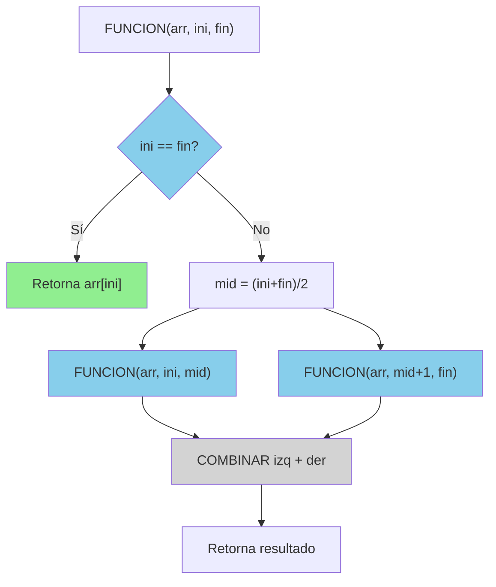
```mermaid
flowchart TD
    A["FUNCION(arr, ini, fin)"]
    B{"ini == fin?"}
    C["Retorna arr[ini]"]
    D["mid = (ini+fin)/2"]
    E["FUNCION(arr, ini, mid)"]
    F["FUNCION(arr, mid+1, fin)"]
    G["COMBINAR izq + der"]
    H["Retorna resultado"]

    A --> B
    B -- "Sí" --> C
    B -- "No" --> D
    D --> E
    D --> F
    E --> G
    F --> G
    G --> H

    style C fill:#90EE90
    style B fill:#87CEEB
    style E fill:#87CEEB
    style F fill:#87CEEB
    style G fill:#D3D3D3
```

### Ejemplo: merge_sort([3,1,4,2])

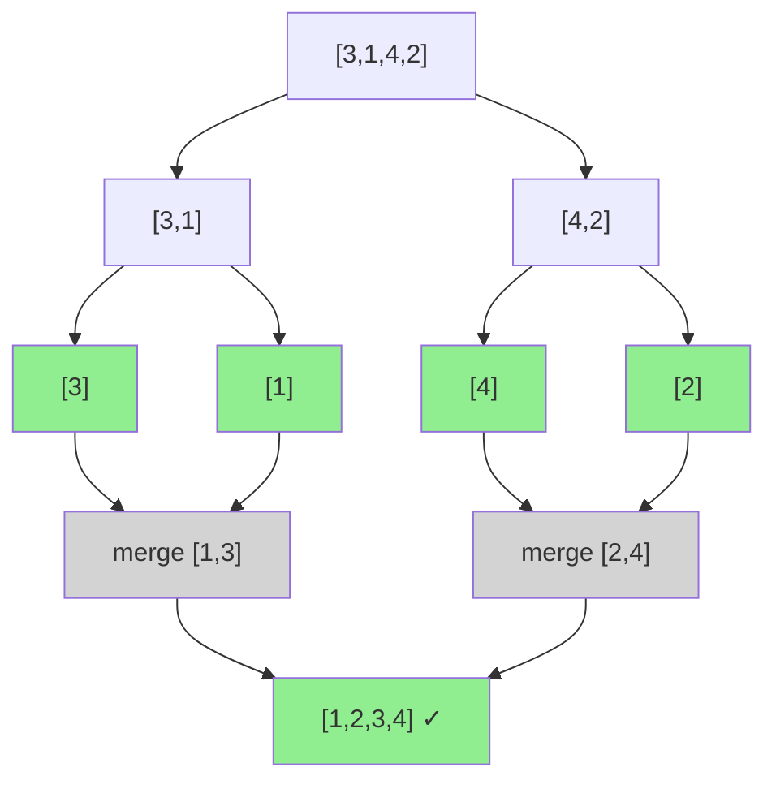
```mermaid
flowchart TD
    A["[3,1,4,2]"]
    B["[3,1]"]
    C["[4,2]"]
    D["[3]"]
    E["[1]"]
    F["[4]"]
    G["[2]"]
    M1["merge [1,3]"]
    M2["merge [2,4]"]
    M3["[1,2,3,4] ✓"]

    A --> B --> D
    B --> E
    A --> C --> F
    C --> G
    D --> M1
    E --> M1
    F --> M2
    G --> M2
    M1 --> M3
    M2 --> M3

    style D fill:#90EE90
    style E fill:#90EE90
    style F fill:#90EE90
    style G fill:#90EE90
    style M3 fill:#90EE90
    style M1 fill:#D3D3D3
    style M2 fill:#D3D3D3
```

---

## 8 · DFS en Árbol o Grafo

> Exploración en profundidad. El trabajo puede ser pre/in/post-order.
> **Complejidad:** `O(V+E)` grafos · `O(n)` árboles

### Plantilla

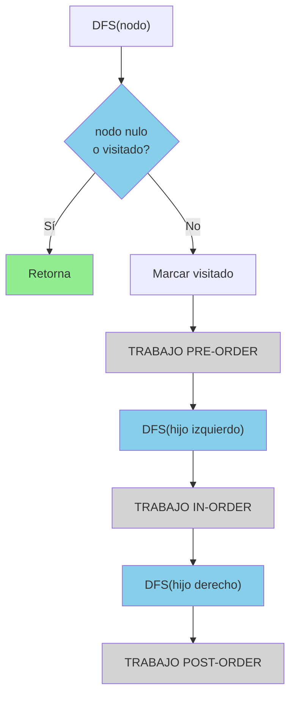
```mermaid
flowchart TD
    A["DFS(nodo)"]
    B{"nodo nulo\no visitado?"}
    C["Retorna"]
    D["Marcar visitado"]
    E["TRABAJO PRE-ORDER"]
    F["DFS(hijo izquierdo)"]
    G["TRABAJO IN-ORDER"]
    H["DFS(hijo derecho)"]
    I["TRABAJO POST-ORDER"]

    A --> B
    B -- "Sí" --> C
    B -- "No" --> D --> E --> F --> G --> H --> I

    style C fill:#90EE90
    style B fill:#87CEEB
    style F fill:#87CEEB
    style H fill:#87CEEB
    style E fill:#D3D3D3
    style G fill:#D3D3D3
    style I fill:#D3D3D3
```

### Ejemplo: altura de árbol (post-order) con raíz=1

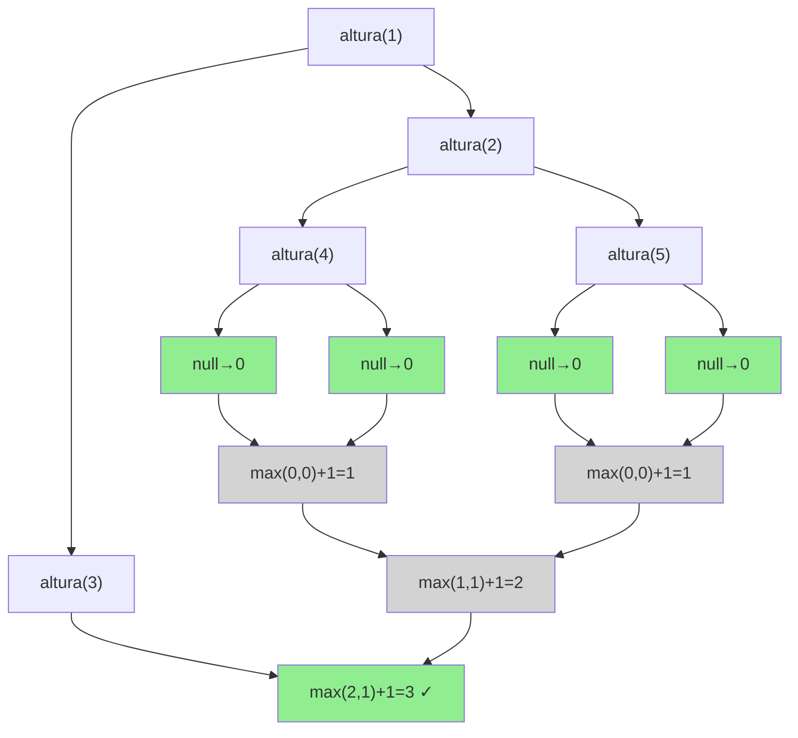
```mermaid
flowchart TD
    N1["altura(1)"]
    N2["altura(2)"]
    N3["altura(3)"]
    N4["altura(4)"]
    N5["altura(5)"]
    NULL1["null→0"]
    NULL2["null→0"]
    NULL3["null→0"]
    NULL4["null→0"]
    R1["max(0,0)+1=1"]
    R2["max(0,0)+1=1"]
    R3["max(1,1)+1=2"]
    RESP["max(2,1)+1=3 ✓"]

    N1 --> N2
    N1 --> N3
    N2 --> N4
    N2 --> N5
    N4 --> NULL1
    N4 --> NULL2
    N5 --> NULL3
    N5 --> NULL4
    NULL1 --> R1
    NULL2 --> R1
    NULL3 --> R2
    NULL4 --> R2
    R1 --> R3
    R2 --> R3
    N3 --> RESP
    R3 --> RESP

    style NULL1 fill:#90EE90
    style NULL2 fill:#90EE90
    style NULL3 fill:#90EE90
    style NULL4 fill:#90EE90
    style RESP fill:#90EE90
    style R1 fill:#D3D3D3
    style R2 fill:#D3D3D3
    style R3 fill:#D3D3D3
```

---

## 9 · DP Tabulación Bottom-Up

> Llena una tabla iterativamente desde los casos base. Sin recursión.
> **Complejidad:** `O(n)` o `O(n²)` según la dimensión

### Plantilla 1D

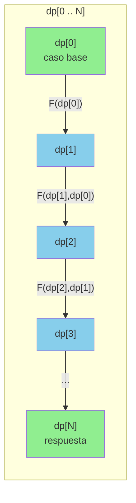
```mermaid
flowchart LR
    subgraph Tabla["dp[0 .. N]"]
        T0["dp[0]\ncaso base"]
        T1["dp[1]"]
        T2["dp[2]"]
        T3["dp[3]"]
        TN["dp[N]\nrespuesta"]
    end

    T0 -- "F(dp[0])" --> T1
    T1 -- "F(dp[1],dp[0])" --> T2
    T2 -- "F(dp[2],dp[1])" --> T3
    T3 -- "..." --> TN

    style T0 fill:#90EE90
    style TN fill:#90EE90
    style T1 fill:#87CEEB
    style T2 fill:#87CEEB
    style T3 fill:#87CEEB
```

### Ejemplo: fib bottom-up hasta fib(6)=8

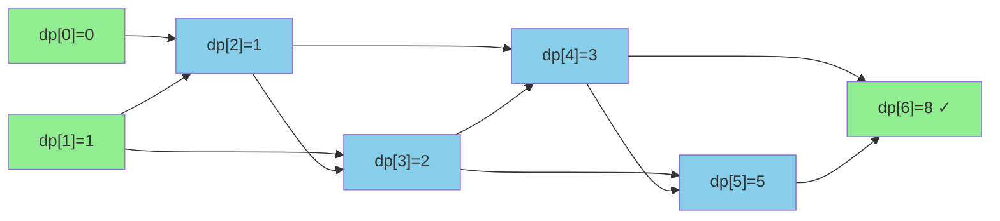
```mermaid
flowchart LR
    T0["dp[0]=0"]
    T1["dp[1]=1"]
    T2["dp[2]=1"]
    T3["dp[3]=2"]
    T4["dp[4]=3"]
    T5["dp[5]=5"]
    T6["dp[6]=8 ✓"]

    T0 --> T2
    T1 --> T2
    T1 --> T3
    T2 --> T3
    T2 --> T4
    T3 --> T4
    T3 --> T5
    T4 --> T5
    T4 --> T6
    T5 --> T6

    style T0 fill:#90EE90
    style T1 fill:#90EE90
    style T6 fill:#90EE90
    style T2 fill:#87CEEB
    style T3 fill:#87CEEB
    style T4 fill:#87CEEB
    style T5 fill:#87CEEB
```

---

## 10 · Backtracking con Poda

> Exploración exhaustiva con corte temprano al violar restricciones.
> **Complejidad:** `O(b^d)` peor caso, drásticamente reducido por la poda

### Plantilla

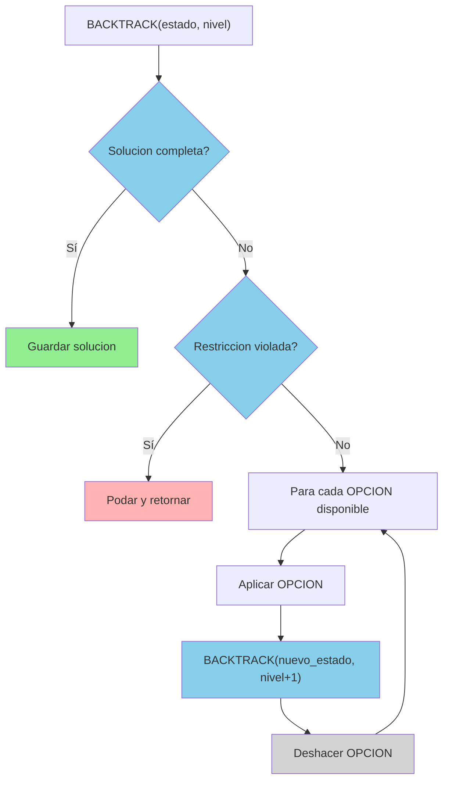
```mermaid
flowchart TD
    A["BACKTRACK(estado, nivel)"]
    B{"Solucion completa?"}
    C["Guardar solucion"]
    D{"Restriccion violada?"}
    E["Podar y retornar"]
    F["Para cada OPCION disponible"]
    G["Aplicar OPCION"]
    H["BACKTRACK(nuevo_estado, nivel+1)"]
    I["Deshacer OPCION"]

    A --> B
    B -- "Sí" --> C
    B -- "No" --> D
    D -- "Sí" --> E
    D -- "No" --> F --> G --> H --> I --> F

    style C fill:#90EE90
    style E fill:#FFB3B3
    style B fill:#87CEEB
    style D fill:#87CEEB
    style H fill:#87CEEB
    style I fill:#D3D3D3
```

### Ejemplo: N-Reinas n=4, fila 1

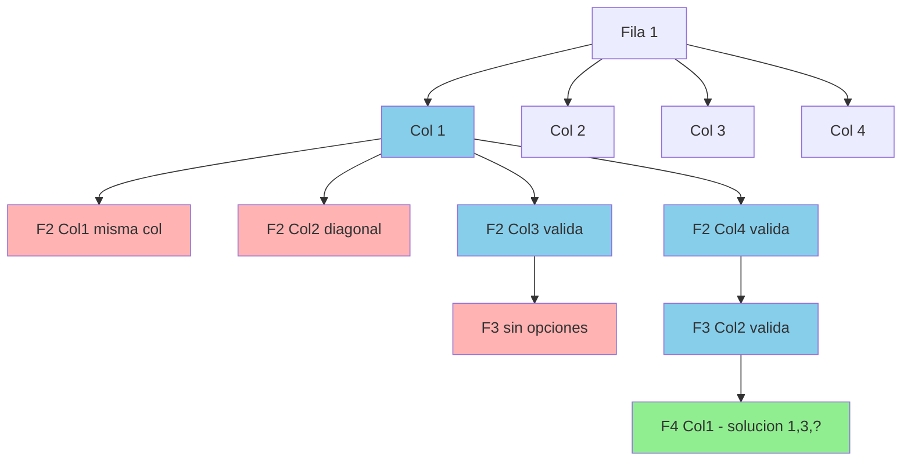
```mermaid
flowchart TD
    ROOT["Fila 1"]
    C1["Col 1"]
    C2["Col 2"]
    C3["Col 3"]
    C4["Col 4"]
    F2A["F2 Col1 misma col"]
    F2B["F2 Col2 diagonal"]
    F2C["F2 Col3 valida"]
    F2D["F2 Col4 valida"]
    F3X["F3 sin opciones"]
    F3OK["F3 Col2 valida"]
    SOL["F4 Col1 - solucion 1,3,?"]

    ROOT --> C1 & C2 & C3 & C4
    C1 --> F2A & F2B & F2C & F2D
    F2C --> F3X
    F2D --> F3OK
    F3OK --> SOL

    style F2A fill:#FFB3B3
    style F2B fill:#FFB3B3
    style F3X fill:#FFB3B3
    style C1 fill:#87CEEB
    style F2C fill:#87CEEB
    style F2D fill:#87CEEB
    style F3OK fill:#87CEEB
    style SOL fill:#90EE90
```

---

## 11 · Stack Explícito sin Recursión

> Simula DFS con pila propia. Evita stack overflow en entradas grandes.
> **Complejidad:** igual que la versión recursiva

### Plantilla

```mermaid
flowchart TD
    A["pila = [INICIO]"]
    B{"pila vacia?"}
    C["Retorna resultado"]
    D["Pop NODO de pila"]
    E{"NODO visitado?"}
    F["Skip"]
    G["Marcar NODO visitado"]
    H["Procesar NODO"]
    I["Push vecinos no visitados"]

    A --> B
    B -- "Sí" --> C
    B -- "No" --> D --> E
    E -- "Sí" --> F --> B
    E -- "No" --> G --> H --> I --> B

    style C fill:#90EE90
    style B fill:#87CEEB
    style E fill:#87CEEB
    style H fill:#D3D3D3
    style F fill:#FFB3B3
```

### Ejemplo: DFS iterativo en grafo A-B-C-D

```mermaid
flowchart LR
    S0["Pila:[A]"]
    S1["Pop A, push B C\nPila:[B,C]"]
    S2["Pop C, push D\nPila:[B,D]"]
    S3["Pop D\nPila:[B]"]
    S4["Pop B\nPila:[]"]
    S5["Orden: A C D B"]

    S0 --> S1 --> S2 --> S3 --> S4 --> S5

    style S0 fill:#87CEEB
    style S5 fill:#90EE90
```

---

## 12 · Dos Punteros

> Dos índices sobre el mismo arreglo (ordenado). Convierte O(n²) en O(n).
> **Complejidad:** `O(n)` tiempo · `O(1)` espacio

### Plantilla

```mermaid
flowchart TD
    A["izq=0, der=len-1"]
    B{"izq < der?"}
    C["Retorna resultado"]
    D["valor = COMBINA(arr[izq], arr[der])"]
    E{"valor == objetivo?"}
    F["Guardar solucion"]
    G{"valor < objetivo?"}
    H["izq++"]
    I["der--"]

    A --> B
    B -- "No" --> C
    B -- "Sí" --> D --> E
    E -- "Sí" --> F --> B
    E -- "No" --> G
    G -- "Sí" --> H --> B
    G -- "No" --> I --> B

    style C fill:#90EE90
    style F fill:#90EE90
    style B fill:#87CEEB
    style E fill:#87CEEB
    style G fill:#87CEEB
```

### Ejemplo: par suma 9 en [1,2,4,5,7,8]

```mermaid
flowchart LR
    subgraph P1["izq=0 der=5"]
        A1["[1  2  4  5  7  8]\n ^                ^"]
        R1["1+8=9 ✓ par encontrado"]
    end
    subgraph P2["Si objetivo=11: izq=0 der=5"]
        A2["1+8=9 menor → izq++"]
    end
    subgraph P3["izq=1 der=5"]
        A3["2+8=10 menor → izq++"]
    end
    subgraph P4["izq=2 der=5"]
        A4["4+8=12 mayor → der--"]
    end
    subgraph P5["izq=2 der=4"]
        A5["4+7=11 ✓"]
    end

    P1 --> P2 --> P3 --> P4 --> P5

    style R1 fill:#90EE90
    style A5 fill:#90EE90
    style A4 fill:#FFD580
```

---

## 13 · Ventana Deslizante

> Ventana de tamaño variable que se mueve sobre el arreglo.
> Cada elemento entra y sale exactamente una vez.
> **Complejidad:** `O(n)` tiempo · `O(k)` espacio (tamaño ventana)

### Plantilla

```mermaid
flowchart TD
    A["izq=0, der=0, inicializar ventana"]
    B{"der < len(arr)?"}
    C["Retorna mejor resultado"]
    D["Agregar arr[der] a ventana"]
    E{"Ventana invalida?"}
    F["Eliminar arr[izq]\nizq++"]
    G["Actualizar mejor resultado"]
    H["der++"]

    A --> B
    B -- "No" --> C
    B -- "Sí" --> D --> E
    E -- "Sí" --> F --> E
    E -- "No" --> G --> H --> B

    style C fill:#90EE90
    style B fill:#87CEEB
    style E fill:#87CEEB
    style F fill:#FFB3B3
    style G fill:#D3D3D3
```

### Ejemplo: substring sin repetidos en "abcba"

```mermaid
flowchart LR
    subgraph V1["der=0"]
        W1["[a]  max=1"]
    end
    subgraph V2["der=1"]
        W2["[ab]  max=2"]
    end
    subgraph V3["der=2"]
        W3["[abc]  max=3"]
    end
    subgraph V4["der=3: b repetido"]
        W4["eliminar a → [bc]  max=3"]
    end
    subgraph V5["der=4"]
        W5["[bca]  max=3 ✓"]
    end

    V1 --> V2 --> V3 --> V4 --> V5

    style W3 fill:#90EE90
    style W5 fill:#90EE90
    style W4 fill:#FFB3B3
```

---

## 14 · Prefix Sums

> Precalcula sumas acumuladas. Consulta de rango en O(1) tras O(n) de precálculo.

### Plantilla

```mermaid
flowchart LR
    subgraph Pre["Precalculo O(n)"]
        P0["prefix[0]=0"]
        P1["prefix[1]=arr[0]"]
        P2["prefix[2]=arr[0]+arr[1]"]
        PN["prefix[n]=suma total"]
        P0 --> P1 --> P2 --> PN
    end

    subgraph Q["Consulta O(1)"]
        QF["suma(L,R) =\nprefix[R+1] - prefix[L]"]
    end

    Pre --> Q

    style P0 fill:#90EE90
    style QF fill:#90EE90
    style P1 fill:#87CEEB
    style P2 fill:#87CEEB
```

### Ejemplo: arr=[2,4,1,3,5], consulta suma(1,3)=8

```mermaid
flowchart LR
    subgraph ARR["arr"]
        A0["2"]
        A1["4"]
        A2["1"]
        A3["3"]
        A4["5"]
    end
    subgraph PFX["prefix"]
        PF0["0"]
        PF1["2"]
        PF2["6"]
        PF3["7"]
        PF4["10"]
        PF5["15"]
    end
    subgraph RES["suma(1,3)"]
        RES1["prefix[4]-prefix[1]"]
        RES2["10 - 2 = 8 ✓"]
        RES1 --> RES2
    end

    ARR --> PFX --> RES

    style PF0 fill:#90EE90
    style RES2 fill:#90EE90
    style PF4 fill:#FFD580
    style PF1 fill:#FFD580
```

---

## 15 · Pila Monótona

> Pila siempre ordenada (creciente o decreciente).
> Al agregar un elemento se expulsan los que rompen el orden.
> **Complejidad:** `O(n)` — cada elemento entra y sale exactamente una vez

### Plantilla

```mermaid
flowchart TD
    A["pila=[], i=0"]
    B{"i < len(arr)?"}
    C["Retorna resultado"]
    D{"pila no vacia Y\narr[i] rompe orden?"}
    E["Pop tope\nProcesar(tope, i)"]
    F["Push i\ni++"]

    A --> B
    B -- "No" --> C
    B -- "Sí" --> D
    D -- "Sí" --> E --> D
    D -- "No" --> F --> B

    style C fill:#90EE90
    style B fill:#87CEEB
    style D fill:#87CEEB
    style E fill:#FFB3B3
    style F fill:#D3D3D3
```

### Ejemplo: siguiente mayor en [2,1,5,3,4]

```mermaid
flowchart LR
    subgraph I0["i=0: push 2"]
        S0["pila=[2]"]
    end
    subgraph I1["i=1: 1<2 push"]
        S1["pila=[2,1]"]
    end
    subgraph I2["i=2: 5>1 pop→nge[1]=5\n5>2 pop→nge[0]=5\npush 5"]
        S2["pila=[5]"]
    end
    subgraph I3["i=3: 3<5 push"]
        S3["pila=[5,3]"]
    end
    subgraph I4["i=4: 4>3 pop→nge[3]=4\n4<5 push"]
        S4["pila=[5,4]"]
    end
    subgraph FIN["nge=[5,5,-1,4,-1] ✓"]
        SF["restantes → -1"]
    end

    I0 --> I1 --> I2 --> I3 --> I4 --> FIN

    style SF fill:#90EE90
    style S2 fill:#D3D3D3
    style S4 fill:#D3D3D3
```

---

## 16 · BFS por Niveles

> Exploración nivel a nivel con cola FIFO.
> Garantiza el camino más corto en grafos no ponderados.
> **Complejidad:** `O(V+E)`

### Plantilla

```mermaid
flowchart LR
    subgraph N0["Nivel 0"]
        S["INICIO dist=0"]
    end
    subgraph N1["Nivel 1"]
        NA["VECINO_A dist=1"]
        NB["VECINO_B dist=1"]
    end
    subgraph N2["Nivel 2"]
        NC["VECINO_C dist=2"]
        ND["VECINO_D dist=2"]
    end
    subgraph N3["Nivel 3"]
        NE["DESTINO dist=3"]
    end

    S --> NA & NB
    NA --> NC
    NB --> NC & ND
    NC --> NE

    style S fill:#87CEEB
    style NE fill:#90EE90
    style NA fill:#FFFACD
    style NB fill:#FFFACD
    style NC fill:#FFFACD
    style ND fill:#FFFACD
```

### Ejemplo: BFS de A a F

```mermaid
flowchart LR
    subgraph C0["Cola: A"]
        CA["A dist=0"]
    end
    subgraph C1["Cola: B C"]
        CB["B dist=1"]
        CC["C dist=1"]
    end
    subgraph C2["Cola: D E"]
        CD["D dist=2"]
        CE["E dist=2"]
    end
    subgraph C3["Cola: F"]
        CF["F dist=3 ✓"]
    end

    CA --> CB & CC
    CB --> CD & CE
    CC --> CE
    CD --> CF
    CE --> CF

    style CA fill:#87CEEB
    style CB fill:#FFFACD
    style CC fill:#FFFACD
    style CD fill:#FFFACD
    style CE fill:#FFFACD
    style CF fill:#90EE90
```

---

## 17 · DFS con Timestamps

> DFS que registra tiempo de entrada y salida.
> Permite detectar ciclos, SCCs y relaciones de ancestro.
> **Complejidad:** `O(V+E)`

### Plantilla

```mermaid
flowchart TD
    A["DFS(nodo, t)"]
    B["entrada[nodo] = t++"]
    C["Estado: EN_PROGRESO"]
    D{"Para cada VECINO"}
    E{"VECINO no visitado?"}
    F["DFS(VECINO, t)"]
    G{"VECINO EN_PROGRESO?"}
    H["CICLO detectado"]
    I["salida[nodo] = t++"]
    J["Estado: FINALIZADO"]

    A --> B --> C --> D
    D --> E
    E -- "Sí" --> F --> D
    E -- "No" --> G
    G -- "Sí" --> H --> D
    G -- "No" --> D
    D -- "fin vecinos" --> I --> J

    style H fill:#FFB3B3
    style J fill:#90EE90
    style B fill:#87CEEB
    style C fill:#87CEEB
    style E fill:#87CEEB
    style G fill:#87CEEB
```

### Ejemplo: grafo A→B→D, A→C→D con timestamps

```mermaid
flowchart TD
    A["A  entra=0  sale=9"]
    B["B  entra=1  sale=6"]
    C["C  entra=7  sale=8"]
    D["D  entra=2  sale=5"]
    E["E  entra=3  sale=4"]

    A --> B
    A --> C
    B --> D
    D --> E
    C --> D

    style A fill:#87CEEB
    style E fill:#90EE90
    style B fill:#DDA0DD
    style C fill:#DDA0DD
    style D fill:#DDA0DD
```

---

## 18 · Dijkstra

> Greedy: siempre expande el nodo con menor distancia acumulada.
> Solo pesos no negativos.
> **Complejidad:** `O((V+E) log V)` con heap

### Plantilla

```mermaid
flowchart TD
    A["dist[ORIGEN]=0\ndist[resto]=inf\nheap=[(0,ORIGEN)]"]
    B{"heap vacio?"}
    C["Retorna dist[]"]
    D["Pop (d, nodo)"]
    E{"d > dist[nodo]?"}
    F["Skip (obsoleto)"]
    G["Para cada (VECINO, PESO)"]
    H["nueva = dist[nodo]+PESO"]
    I{"nueva < dist[VECINO]?"}
    J["dist[VECINO]=nueva\nPush (nueva, VECINO)"]

    A --> B
    B -- "Sí" --> C
    B -- "No" --> D --> E
    E -- "Sí" --> F --> B
    E -- "No" --> G --> H --> I
    I -- "Sí" --> J --> G
    I -- "No" --> G

    style C fill:#90EE90
    style B fill:#87CEEB
    style E fill:#87CEEB
    style I fill:#87CEEB
    style F fill:#FFB3B3
    style J fill:#D3D3D3
```

### Ejemplo: A→B(4), A→C(2), C→B(1), B→D(5)

```mermaid
flowchart LR
    A["A  dist=0"]
    C["C  dist=2"]
    B["B  dist=3\nvia A→C→B"]
    D["D  dist=8"]

    A -- "2" --> C
    A -- "4" --> B
    C -- "1" --> B
    B -- "5" --> D

    NOTE["Ruta optima: A→C→B→D = 8\nno A→B→D = 9"]

    style A fill:#90EE90
    style D fill:#90EE90
    style C fill:#87CEEB
    style B fill:#87CEEB
```

---

## 19 · Bellman-Ford

> Relaja todas las aristas V-1 veces. Detecta ciclos negativos.
> **Complejidad:** `O(V·E)`

### Plantilla

```mermaid
flowchart TD
    A["dist[ORIGEN]=0, resto=inf"]
    B["i=1"]
    C{"i <= V-1?"}
    D["Para cada arista (u,v,w)"]
    E{"dist[u]+w < dist[v]?"}
    F["dist[v] = dist[u]+w"]
    G["i++"]
    H["Iteracion extra V"]
    I{"Alguna arista\nse relaja aun?"}
    J["CICLO NEGATIVO"]
    K["Retorna dist[]"]

    A --> B --> C
    C -- "Sí" --> D --> E
    E -- "Sí" --> F --> D
    E -- "No" --> D
    D -- "fin aristas" --> G --> C
    C -- "No" --> H --> I
    I -- "Sí" --> J
    I -- "No" --> K

    style K fill:#90EE90
    style J fill:#FFB3B3
    style C fill:#87CEEB
    style E fill:#87CEEB
    style I fill:#87CEEB
    style F fill:#D3D3D3
```

### Ejemplo: 3 nodos A→B(3), A→C(5), B→C(1)

```mermaid
flowchart LR
    I0["Inicio: A=0 B=inf C=inf"]
    I1["Iter 1: A→B: B=3\nA→C: C=5\nB→C: C=min(5,4)=4"]
    I2["Iter 2: sin cambios"]
    IF["dist: A=0 B=3 C=4 ✓"]

    I0 --> I1 --> I2 --> IF

    style I0 fill:#87CEEB
    style IF fill:#90EE90
    style I1 fill:#D3D3D3
```

---

## 20 · Floyd-Warshall

> DP en 3D: considera cada nodo k como intermediario.
> Todos los pares de distancias.
> **Complejidad:** `O(V³)` tiempo · `O(V²)` espacio

### Plantilla

```mermaid
flowchart TD
    A["Inicializar dist[i][j]\ncon pesos directos e inf"]
    B["dist[i][i]=0 para todo i"]
    C["Para k=0..V-1"]
    D["Para i=0..V-1"]
    E["Para j=0..V-1"]
    F{"dist[i][k]+dist[k][j]\n< dist[i][j]?"}
    G["dist[i][j]=dist[i][k]+dist[k][j]"]
    H{"dist[i][i]<0\npara algun i?"}
    I["CICLO NEGATIVO"]
    J["Retorna dist[][]"]

    A --> B --> C --> D --> E --> F
    F -- "Sí" --> G --> E
    F -- "No" --> E
    E -- "fin j" --> D
    D -- "fin i" --> C
    C -- "fin k" --> H
    H -- "Sí" --> I
    H -- "No" --> J

    style J fill:#90EE90
    style I fill:#FFB3B3
    style C fill:#87CEEB
    style F fill:#87CEEB
    style G fill:#D3D3D3
```

---

## 21 · Kruskal y Prim MST

> **Kruskal:** ordena aristas, agrega si no forma ciclo (Union-Find).
> **Prim:** expande desde un nodo, siempre la arista más barata.
> **Complejidad:** `O(E log E)` Kruskal · `O((V+E) log V)` Prim

### Plantilla Kruskal

```mermaid
flowchart TD
    A["Ordenar aristas por peso ASC"]
    B["Union-Find: cada nodo es raiz"]
    C["Para cada arista (u,v,w)"]
    D{"find(u) != find(v)?"}
    E["Agregar al MST\nunion(u,v)"]
    F["Descartar (ciclo)"]
    G{"MST tiene V-1 aristas?"}
    H["Retorna MST ✓"]

    A --> B --> C --> D
    D -- "Sí" --> E --> G
    D -- "No" --> F --> C
    G -- "Sí" --> H
    G -- "No" --> C

    style H fill:#90EE90
    style D fill:#87CEEB
    style G fill:#87CEEB
    style E fill:#D3D3D3
    style F fill:#FFB3B3
```

### Ejemplo Kruskal: 4 nodos

```mermaid
flowchart TD
    subgraph ARS["Aristas ordenadas"]
        E1["B-C peso=1 → MST"]
        E2["A-C peso=2 → MST"]
        E3["A-B peso=4 → ciclo A-B-C"]
        E4["B-D peso=5 → MST"]
    end
    subgraph MST["MST costo=8"]
        MA["A"]
        MB["B"]
        MC["C"]
        MD["D"]
        MA -- "2" --> MC
        MC -- "1" --> MB
        MB -- "5" --> MD
    end

    ARS --> MST

    style E1 fill:#90EE90
    style E2 fill:#90EE90
    style E4 fill:#90EE90
    style E3 fill:#FFB3B3
```

---

## 22 · Ordenamiento Topológico Kahn

> BFS sobre DAG comenzando por nodos sin dependencias (in-degree=0).
> **Complejidad:** `O(V+E)`

### Plantilla

```mermaid
flowchart TD
    A["Calcular in_degree[v]"]
    B["Cola = nodos con in_degree=0"]
    C{"Cola vacia?"}
    D{"procesados==V?"}
    E["CICLO - no es DAG"]
    F["Retorna orden topologico"]
    G["Pop nodo, agregar a orden"]
    H["Para cada VECINO: in_degree[VECINO]--"]
    I{"in_degree[VECINO]==0?"}
    J["Encolar VECINO"]

    A --> B --> C
    C -- "Sí" --> D
    D -- "No" --> E
    D -- "Sí" --> F
    C -- "No" --> G --> H --> I
    I -- "Sí" --> J --> C
    I -- "No" --> H

    style F fill:#90EE90
    style E fill:#FFB3B3
    style C fill:#87CEEB
    style D fill:#87CEEB
    style I fill:#87CEEB
    style G fill:#D3D3D3
```

### Ejemplo: 5 módulos con dependencias

```mermaid
flowchart LR
    subgraph DAG["Dependencias"]
        A["A"]
        B["B"]
        C["C"]
        D["D"]
        E["E"]
        A --> C
        B --> C
        C --> D
        B --> E
        D --> E
    end
    subgraph ORD["Orden Kahn"]
        O1["1. A in=0"]
        O2["2. B in=0"]
        O3["3. C in=2→0"]
        O4["4. D in=1→0"]
        O5["5. E in=2→0"]
    end

    DAG --> ORD

    style O1 fill:#90EE90
    style O2 fill:#90EE90
    style O5 fill:#90EE90
    style O3 fill:#87CEEB
    style O4 fill:#87CEEB
```

---

## 23 · Heap sift-up y sift-down

> El heap mantiene la propiedad restaurándola hacia arriba (inserción)
> o hacia abajo (extracción). Ambas operaciones son `O(log n)`.

### Plantilla sift-up (inserción)

```mermaid
flowchart TD
    A["Insertar VALOR al final\ni = len-1"]
    B{"i>0 Y\narr[padre(i)] > arr[i]?"}
    C["Heap restaurado"]
    D["Swap arr[padre] y arr[i]"]
    E["i = padre(i)"]

    A --> B
    B -- "No" --> C
    B -- "Sí" --> D --> E --> B

    style C fill:#90EE90
    style B fill:#87CEEB
    style D fill:#D3D3D3
```

### Plantilla sift-down (extracción)

```mermaid
flowchart TD
    A["Mover ultimo elemento a raiz\ni=0"]
    B{"Algun hijo menor\nque arr[i]?"}
    C["Heap restaurado"]
    D["menor = hijo mas pequeño"]
    E["Swap arr[i] y arr[menor]"]
    F["i = menor"]

    A --> B
    B -- "No" --> C
    B -- "Sí" --> D --> E --> F --> B

    style C fill:#90EE90
    style B fill:#87CEEB
    style D fill:#D3D3D3
    style E fill:#D3D3D3
```

### Ejemplo: insertar 2 en heap [1,3,5,7,4]

```mermaid
flowchart LR
    subgraph ANTES["Heap [1,3,5,7,4]"]
        R["1"]
        L["3"]
        RR["5"]
        LL["7"]
        LR["4"]
        R --> L & RR
        L --> LL & LR
    end
    subgraph PASO["Insertar 2 al final"]
        P1["[1,3,5,7,4,2]  i=5"]
        P2["padre(5)=2 → arr[2]=5>2 swap"]
        P3["[1,3,2,7,4,5]  i=2"]
        P4["padre(2)=0 → arr[0]=1<2 STOP"]
        P1 --> P2 --> P3 --> P4
    end
    subgraph DESPUES["Resultado [1,3,2,7,4,5]"]
        R2["1"]
        L2["3"]
        RR2["2"]
        LL2["7"]
        LR2["4"]
        RL2["5"]
        R2 --> L2 & RR2
        L2 --> LL2 & LR2
        RR2 --> RL2
    end

    ANTES --> PASO --> DESPUES

    style P4 fill:#90EE90
    style P2 fill:#D3D3D3
```

---

## 24 · Greedy Genérico

> En cada paso se toma la decisión localmente óptima sin reconsiderar.
> Funciona cuando se puede demostrar el "exchange argument".
> **Complejidad:** `O(n log n)` por el ordenamiento

### Plantilla

```mermaid
flowchart TD
    A["Ordenar por CRITERIO_GREEDY"]
    B["Inicializar solucion vacia"]
    C{"Quedan elementos?"}
    D["Retorna solucion"]
    E["Tomar MEJOR_ELEMENTO"]
    F{"Es valido?"}
    G["Agregar a solucion\nActualizar estado"]
    H["Descartar"]

    A --> B --> C
    C -- "No" --> D
    C -- "Sí" --> E --> F
    F -- "Sí" --> G --> C
    F -- "No" --> H --> C

    style D fill:#90EE90
    style G fill:#90EE90
    style F fill:#87CEEB
    style C fill:#87CEEB
    style H fill:#FFB3B3
```

### Ejemplo: actividades no solapadas

```mermaid
flowchart TD
    SORT["Ordenar por fin:\n[1,3],[2,4],[3,5],[0,6]"]
    T1["[1,3]: 1>=−inf → tomar\nfin=3 count=1"]
    T2["[2,4]: 2<3 → descartar"]
    T3["[3,5]: 3>=3 → tomar\nfin=5 count=2"]
    T4["[0,6]: 0<5 → descartar"]
    RES["Resultado: 2 actividades ✓"]

    SORT --> T1 --> T2 --> T3 --> T4 --> RES

    style T1 fill:#90EE90
    style T3 fill:#90EE90
    style T2 fill:#FFB3B3
    style T4 fill:#FFB3B3
    style RES fill:#90EE90
```

---

## 25 · Union-Find con Compresión

> Gestiona componentes conectados dinámicamente.
> Path compression + union by rank → `O(α(n)) ≈ O(1)` amortizado.

### Plantilla find (con path compression)

```mermaid
flowchart TD
    FA["find(x)"]
    FB{"padre[x] == x?"}
    FC["Retorna x (es raiz)"]
    FD["padre[x] = find(padre[x])"]
    FE["Retorna padre[x]"]

    FA --> FB
    FB -- "Sí" --> FC
    FB -- "No" --> FD --> FE

    style FC fill:#90EE90
    style FB fill:#87CEEB
    style FD fill:#D3D3D3
```

### Plantilla union (por rango)

```mermaid
flowchart TD
    UA["rx=find(x)  ry=find(y)"]
    UB{"rx == ry?"}
    UC["Ya unidos - ignorar"]
    UD{"rank[rx] > rank[ry]?"}
    UE["padre[ry] = rx"]
    UF["padre[rx] = ry\nsi igual rank: rank[ry]++"]

    UA --> UB
    UB -- "Sí" --> UC
    UB -- "No" --> UD
    UD -- "Sí" --> UE
    UD -- "No" --> UF

    style UC fill:#FFD580
    style UE fill:#D3D3D3
    style UF fill:#D3D3D3
    style UB fill:#87CEEB
    style UD fill:#87CEEB
```

### Ejemplo: union-find 5 nodos, find(3) con compresión

```mermaid
flowchart LR
    subgraph E0["Inicial"]
        N0["0"] N1["1"] N2["2"] N3["3"] N4["4"]
    end
    subgraph E1["union(0,1)\nunion(2,3)"]
        G1["0→1\n2→3"]
    end
    subgraph E2["union(0,2)"]
        G2["0\n├1\n└2\n  └3"]
    end
    subgraph E3["find(3) con compresión"]
        G3["0\n├1\n├2\n└3 (comprimido)"]
    end

    E0 --> E1 --> E2 --> E3

    style G3 fill:#90EE90
    style G2 fill:#87CEEB
```

---

## 26 · Trie Insertar y Buscar

> Árbol donde cada nodo es un carácter. Comparte prefijos.
> **Complejidad:** `O(m)` por operación, m = longitud de la palabra

### Plantilla insert

```mermaid
flowchart TD
    IA["nodo = raiz"]
    IB{"Quedan chars?"}
    IC["nodo.es_fin = True"]
    ID["c = siguiente char"]
    IE{"c en nodo.hijos?"}
    IF["Crear nodo.hijos[c]"]
    IG["nodo = nodo.hijos[c]\navanzar"]

    IA --> IB
    IB -- "No" --> IC
    IB -- "Sí" --> ID --> IE
    IE -- "No" --> IF --> IG --> IB
    IE -- "Sí" --> IG

    style IC fill:#90EE90
    style IB fill:#87CEEB
    style IE fill:#87CEEB
    style IF fill:#D3D3D3
```

### Plantilla search

```mermaid
flowchart TD
    SA["nodo = raiz"]
    SB{"Quedan chars?"}
    SC{"nodo.es_fin?"}
    SD["Retorna True"]
    SE["Retorna False"]
    SF["c = siguiente char"]
    SG{"c en nodo.hijos?"}
    SH["Retorna False"]
    SI["nodo = nodo.hijos[c]"]

    SA --> SB
    SB -- "No" --> SC
    SC -- "Sí" --> SD
    SC -- "No" --> SE
    SB -- "Sí" --> SF --> SG
    SG -- "No" --> SH
    SG -- "Sí" --> SI --> SB

    style SD fill:#90EE90
    style SE fill:#FFB3B3
    style SH fill:#FFB3B3
    style SB fill:#87CEEB
    style SG fill:#87CEEB
```

### Ejemplo: Trie con "can", "cat", "car"

```mermaid
flowchart TD
    ROOT["raiz"]
    C["c"]
    A["a"]
    N["n  is_end=True  can"]
    T["t  is_end=True  cat"]
    R["r  is_end=True  car"]

    ROOT --> C --> A
    A --> N & T & R

    style N fill:#90EE90
    style T fill:#90EE90
    style R fill:#90EE90
    style ROOT fill:#87CEEB
    style C fill:#FFFACD
    style A fill:#FFFACD
```

---

## 27 · KMP Tabla de Fallos y Búsqueda

> Precalcula `lps[]` (longest proper prefix = suffix) para no retroceder en texto.
> **Complejidad:** `O(n+m)` — n=texto, m=patrón

### Plantilla: construir lps

```mermaid
flowchart TD
    A["lps=[0]*len(p)\ni=1, len=0"]
    B{"i < len(p)?"}
    C["Retorna lps[]"]
    D{"p[i]==p[len]?"}
    E["len++\nlps[i]=len\ni++"]
    F{"len > 0?"}
    G["len=lps[len-1]"]
    H["lps[i]=0\ni++"]

    A --> B
    B -- "No" --> C
    B -- "Sí" --> D
    D -- "Sí" --> E --> B
    D -- "No" --> F
    F -- "Sí" --> G --> D
    F -- "No" --> H --> B

    style C fill:#90EE90
    style B fill:#87CEEB
    style D fill:#87CEEB
    style F fill:#87CEEB
    style E fill:#D3D3D3
    style G fill:#FFD580
```

### Ejemplo: lps para "AABAAB" → [0,1,0,1,2,3]

```mermaid
flowchart LR
    subgraph PAT["Patrón"]
        P0["A lps=0"]
        P1["A lps=1"]
        P2["B lps=0"]
        P3["A lps=1"]
        P4["A lps=2"]
        P5["B lps=3"]
        P0 --> P1 --> P2 --> P3 --> P4 --> P5
    end
    subgraph SIG["lps[5]=3 significa"]
        M["Prefijo 'AAB' = Sufijo 'AAB'\nno retroceder en texto al fallar aqui"]
    end
    PAT --> SIG

    style P5 fill:#90EE90
    style P1 fill:#FFD580
    style P4 fill:#FFD580
    style M fill:#D3D3D3
```

---

## 28 · Bitmask DP

> El estado incluye una máscara de bits representando un subconjunto visitado.
> `O(2^n · n)` en lugar de `O(n!)`.
> **Uso:** TSP, asignación óptima, cobertura con n ≤ 20

### Plantilla

```mermaid
flowchart TD
    A["dp[mask][i] = costo de llegar\nal estado mask terminando en i"]
    B["dp[1<<inicio][inicio] = 0\nresto = inf"]
    C["Para mask = 0 a 2^N - 1"]
    D["Para cada i con bit i en mask"]
    E{"dp[mask][i] != inf?"}
    F["Para cada j no en mask"]
    G["nuevo = mask OR 1<<j"]
    H["dp[nuevo][j] = min(dp[nuevo][j],\ndp[mask][i] + costo[i][j])"]
    I["Respuesta: min sobre i de\ndp[FULL][i] + costo[i][inicio]"]

    A --> B --> C --> D --> E
    E -- "Sí" --> F --> G --> H --> F
    E -- "No" --> D
    D -- "fin" --> C
    C -- "fin" --> I

    style B fill:#90EE90
    style I fill:#90EE90
    style C fill:#87CEEB
    style E fill:#87CEEB
    style H fill:#D3D3D3
```

### Ejemplo: TSP 4 ciudades — evolución de máscaras

```mermaid
flowchart LR
    subgraph MASKS["Desde ciudad 0 (mask=0001)"]
        M1["0001 → solo ciudad 0\ndp=0"]
        M2["0011 → ciudades 0,1\ndp=dist(0,1)"]
        M3["0101 → ciudades 0,2\ndp=dist(0,2)"]
        M4["0111 → ciudades 0,1,2\ndp=min(...)"]
        M5["1111 → todas\nregresar a 0"]
    end

    M1 --> M2 & M3
    M2 --> M4
    M3 --> M4
    M4 --> M5

    style M1 fill:#90EE90
    style M5 fill:#90EE90
    style M4 fill:#87CEEB
```

---

## Guía rápida de sintaxis Mermaid

```text
Tipos de diagrama:
  flowchart TD   → top-down (recursión, DFS)
  flowchart LR   → left-right (BFS, tablas, flujos)

Formas de nodos:
  A["texto"]     → rectángulo  (nodo normal)
  B{"texto"}     → rombo       (condición / decisión)
  C(["texto"])   → estadio     (inicio / fin)

Tipos de flecha:
  A --> B                 → normal
  A -- "etiqueta" --> B   → con etiqueta
  A -.-> B                → punteada

Colores:
  style A fill:#90EE90    → verde   (caso base / éxito)
  style A fill:#87CEEB    → azul    (activo / decisión)
  style A fill:#FFD580    → naranja (memo / cache hit)
  style A fill:#FFB3B3    → rojo    (podado / inválido)
  style A fill:#D3D3D3    → gris    (combinación / merge)
  style A fill:#DDA0DD    → violeta (visitado en grafo)
  style A fill:#FFFACD    → amarillo (en cola / pendiente)

Subgrafos:
  subgraph Nombre["Etiqueta"]
      A["nodo"]
  end
```

---

## Índice por capítulo

| Capítulo | Plantillas |
|---|---|
| Cap. 01 — Tipos de recursión | 1, 2, 3, 4, 5, 6, 7, 8 |
| Cap. 02 — Optimización recursiva | 6, 9, 10, 11 |
| Cap. 03 — Reducción de complejidad | 12, 13, 14, 15 |
| Cap. 04 — Grafos | 16, 17, 18, 19, 20, 21, 22 |
| Cap. 05 — Heap y Cola de Prioridad | 23 |
| Cap. 06 — Greedy | 24 |
| Cap. 09 — Union-Find | 25 |
| Cap. 10 — Trie | 26 |
| Cap. 12 — KMP / Rabin-Karp | 27 |
| Cap. 13 — Bit Manipulation | 28 |


